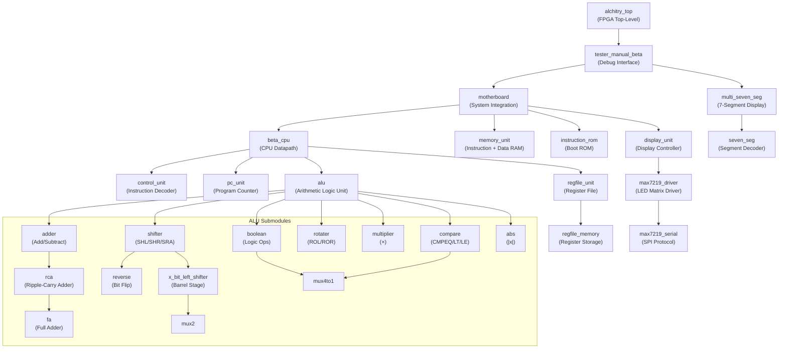

# Beta CPU — Lucid HDL Implementation

A 32-bit Beta CPU microprocessor implemented in Lucid HDL for the Alchitry FPGA board. The design covers a full datapath including an ALU, register file, program counter, memory subsystem, and dual MAX7219 LED matrix display output.

---

## Module Interaction Diagram



---

## Module Reference

### Top-Level & Integration

#### `alchitry_top.luc`
The root FPGA module. Conditions the active-low reset signal and routes all physical I/O pins (clock, buttons, DIP switches, LEDs, 7-segment display, USB serial) to `tester_manual_beta`.

#### `tester_manual_beta.luc`
Debug and hardware interface layer sitting between `alchitry_top` and the `motherboard`. Provides:
- **Manual step mode** (button[4]) or **auto-run** (io_dip[2][7])
- **Fast/slow clock** selection (io_dip[2][6])
- **Interrupt injection** via buttons[2:0]
- DIP-switch-selectable debug views (instruction address, data, register states, PC mode bit, I/O buffers)
- Drives the `multi_seven_seg` display with the selected 16-bit value

#### `motherboard.luc`
System integration hub. Wires together the CPU, memory, ROM, and display, and manages the boot sequence via a state machine:

```
INSTRUCTIONLOAD → RUN → LOAD_OUTPUT → DISPLAY_OUTPUT → UPDATE_INPUT → RUN …
```

- Copies `instruction_rom` contents into `memory_unit` RAM at startup
- Dispatches CPU memory writes to either data RAM (ia[31]=0) or `display_unit` (ia[31]=1)
- Maintains an output buffer (address `0xC`) and input buffer (address `0x10`) for I/O

---

### CPU Core

#### `beta_cpu.luc`
The top-level CPU datapath. Instantiates and wires `control_unit`, `pc_unit`, `regfile_unit`, and `alu`. Implements the key datapath multiplexers:

| Mux | Selects |
|-----|---------|
| **ASEL** | RD1 (register) or PC+4 (for LDR/branch-and-link) |
| **BSEL** | RD2 (register) or sign-extended immediate |
| **WDSEL** | ALU output, PC+4, or memory read data |

Exposes `ia` (instruction address), memory address/data/write-enable, and 4×16-bit debug signals.

#### `control_unit.luc`
ROM-based instruction decoder. Takes the 6-bit opcode and produces all datapath control signals:

| Output | Purpose |
|--------|---------|
| `pcsel[3]` | Next PC source (sequential / branch / JMP / kernel trap) |
| `alufn[6]` | ALU operation |
| `asel`, `bsel` | Operand mux selects |
| `wdsel[2]` | Write-back data select |
| `werf` | Register file write enable |
| `wr` | Data memory write enable |
| `wasel` | Write address (RC vs R31/link) |
| `ra2sel` | Read port 2 address (RB vs RC) |

Also samples the `irq` interrupt line with a DFF and suppresses interrupts when already in kernel mode (PC[31]=1).

**Supported opcodes:** ADD, SUB, MUL, AND, OR, XOR (and immediate variants), SHL, SHR, SRA, ROL, ROR, CMPEQ, CMPLT, CMPLE, LD, ST, LDR, BEQ, BNE, JMP, ILLOP, plus ABSA/ABSS/ABSM and REVA/REVS/REVM extensions.

#### `pc_unit.luc`
Manages the 32-bit program counter. Advances only on the slow clock edge and supports five next-PC sources:

| `pcsel` | Next PC |
|---------|---------|
| `000` | PC + 4 (sequential) |
| `001` | PC + 4 + 4×SXT(imm16) (branch) |
| `010` | Register value (JMP, bits[1:0] masked) |
| `011` | `0x80000004` (supervisor trap) |
| `100` | `0x80000008` (interrupt handler) |

Resets to `0x80000000`. Preserves PC[31] (kernel/user mode bit) across operations.

#### `regfile_unit.luc`
Wrapper around `regfile_memory` providing dual read ports and single write port with control muxes:

- **RA2SEL:** Selects read port 2 address as RB or RC
- **WASEL:** Selects write address as RC or R31 (link register)
- Computes the **Z flag** (NOR of all RD1 bits) used by branch instructions
- Exposes `mwd` (memory write data = RD2) to the CPU output bus

#### `regfile_memory.luc`
Raw 32×32-bit DFF register array. R31 is hardwired to zero: writes to address 31 are silently ignored. Both read ports are asynchronous; writes are synchronous to the main clock.

---

### Memory

#### `memory_unit.luc`
Unified byte-addressable memory subsystem parameterised by `WORDS`. Contains:
- `simple_ram` — single-port **instruction memory** (written at boot, read during fetch)
- `simple_dual_port_ram` — dual-port **data memory** (separate read/write addresses)

Address bits [1:0] are the word-select within each 32-bit word (only word-aligned accesses are used in practice).

#### `instruction_rom.luc`
Hard-coded read-only boot ROM. Provides the startup program that `motherboard` copies into instruction RAM before the CPU begins executing. Returns the total instruction count via `numinstr` so the loader knows when to stop.

---

### ALU

#### `alu.luc`
Top-level ALU. Routes operands A and B to one of eight functional units based on `alufn[5:4]`:

| `alufn[5:4]` | `alufn[1]` | Operation |
|---|---|---|
| `00` | 0 | Adder (ADD/SUB) |
| `00` | 1 | Multiplier |
| `01` | — | Boolean (AND/OR/XOR/…) |
| `10` | `alufn[3:2]=00` | Shifter (SHL/SHR/SRA) |
| `10` | `alufn[3:2]=01` | Rotater (ROL/ROR) |
| `10` | `alufn[3:2]=10` | Absolute value |
| `10` | `alufn[3:2]=11` | Bit reverse |
| `11` | — | Compare (CMPEQ/CMPLT/CMPLE) |

Outputs the 32-bit result plus Z, V, N flags.

#### `adder.luc`
32-bit two's complement adder/subtractor. XORs operand B with `alufn[0]` (0=ADD, 1=SUB) before passing to the ripple-carry chain. Computes overflow (V) and negative (N) flags alongside the zero (Z) flag.

#### `rca.luc` / `fa.luc`
Ripple-carry adder built from an array of `fa` (full adder) cells. `fa` implements the canonical single-bit add with carry.

#### `boolean.luc`
Bitwise logic unit. Uses `alufn[3:0]` as a 4-entry truth table looked up by the (a,b) bit pair at each position — enabling AND, OR, XOR, XNOR and any other 2-input Boolean function.

#### `shifter.luc`
Five-stage barrel shifter for SHL, SHR, and SRA. Right shifts are implemented by reversing bits, shifting left, then reversing back. SRA pads with the sign bit; SHL/SHR pad with zero.

#### `rotater.luc`
Implements ROL and ROR as `(a << b) | (a >> (32-b))` and its mirror.

#### `multiplier.luc`
32×32→32 multiplication (lower 32 bits) via Lucid's native `*` operator.

#### `compare.luc`
Derives CMPEQ, CMPLT, and CMPLE from the adder flags:
- **CMPEQ:** Z
- **CMPLT:** N XOR V
- **CMPLE:** (N XOR V) OR Z

#### `abs.luc`
Absolute value: if the sign bit is set, returns the two's complement negation; otherwise passes the value through unchanged.

#### `reverse.luc`
Bit-order reversal — maps bit i to bit (SIZE−1−i). Used internally by `shifter` and exposed as a standalone ALU operation (REVA/REVS/REVM).

#### `x_bit_left_shifter.luc`
Single barrel-shifter stage that shifts by a fixed power-of-two amount (`SHIFT` parameter). Used as a building block by `shifter`.

---

### Simple Primitives

#### `mux2.luc`
1-bit 2-to-1 multiplexer.

#### `mux4to1.luc`
1-bit 4-to-1 multiplexer. Implements `y = data[{s1, s0}]`.

---

### Display

#### `display_unit.luc`
Controller for two chained MAX7219 LED matrix drivers. Maintains a 16-word (512-bit) shadow buffer of display data and a 16-bit dirty flag (`new_buf`). When a word is written, the corresponding dirty bit is set. A state machine iterates over dirty entries, sends each modified row to `max7219_driver`, and clears the flag.

```
IDLE → CHECK → STORE → (repeat per dirty row) → IDLE
```

#### `max7219_driver.luc`
Handles the full MAX7219 initialisation and row-update sequence for one or more chained chips. Runs through a fixed boot sequence (shutdown → set intensity → set decode mode → set scan limit → load data → wake up) before entering an idle state ready for row updates.

```
INITIALIZE → SEND_INITIAL_SHUTDOWN → SEND_INTENSITY → SEND_NO_DECODE
→ SEND_SCAN_ALL_DIGITS → SEND_WORD → SEND_TURN_ON → IDLE
```

#### `max7219_serial.luc`
SPI-like bit-serial protocol engine for chained MAX7219 devices. For each transfer:
1. Sends 8-bit address (MSB first)
2. Sends 8-bit data (bit-reversed for hardware compatibility)
3. Repeats for each device in the chain
4. Pulses the load (CS) line to latch data

Parameters `CHAIN` and `SPEED` control the number of chained devices and the serial clock frequency.

---

### Debug Display

#### `multi_seven_seg.luc`
Multiplexed multi-digit 7-segment display driver. Uses a counter to cycle through up to `DIGITS` digits at a rate controlled by `DIV`, outputting one-hot digit-select and segment signals.

#### `seven_seg.luc`
Combinational decoder: converts a 4-bit hex digit (0–F) to a 7-bit segment pattern.

---

## Directory Structure

```
source/
├── alchitry_top.luc          # FPGA top-level
├── tester_manual_beta.luc    # Debug / hardware interface
├── motherboard.luc           # System integration
├── beta_cpu.luc              # CPU datapath
├── control_unit.luc          # Instruction decoder (ROM-based)
├── pc_unit.luc               # Program counter
├── regfile_unit.luc          # Register file wrapper
├── regfile_memory.luc        # 32×32-bit register array
├── memory_unit.luc           # Instruction + data RAM
├── instruction_rom.luc       # Boot ROM
├── display_unit.luc          # Display controller
├── max7219_driver.luc        # MAX7219 init & row update
├── max7219_serial.luc        # SPI serial protocol
├── seven_seg.luc             # Hex → 7-segment decoder
├── multi_seven_seg.luc       # Multiplexed digit display
├── test_serial.luc           # Serial protocol testbench
│
├── alu/
│   ├── alu.luc               # Top-level ALU
│   ├── adder.luc             # Add/subtract + flags
│   ├── boolean.luc           # Bitwise logic
│   ├── shifter.luc           # SHL / SHR / SRA
│   ├── rotater.luc           # ROL / ROR
│   ├── multiplier.luc        # 32×32 multiply
│   ├── compare.luc           # CMPEQ / CMPLT / CMPLE
│   ├── abs.luc               # Absolute value
│   └── test_*.luc            # ALU unit tests
│
├── simple/
│   ├── mux2.luc              # 2-to-1 mux
│   ├── mux4to1.luc           # 4-to-1 mux
│   ├── rca.luc               # Ripple-carry adder
│   ├── fa.luc                # Full adder cell
│   ├── reverse.luc           # Bit-order reversal
│   ├── x_bit_left_shifter.luc# Barrel shifter stage
│   └── test_simple.luc       # Primitive tests
│
└── test_cpu/
    ├── test_beta_cpu.luc     # Full CPU testbench
    ├── test_control_unit.luc # Control unit tests
    ├── test_pc_unit.luc      # PC unit tests
    └── test_regfile_unit.luc # Register file tests
```

---

## Key Design Patterns

| Pattern | Where used |
|---------|-----------|
| ROM-based control | `control_unit` — one 64-entry ROM row per opcode |
| Datapath muxes (ASEL/BSEL/WDSEL) | `beta_cpu` — select operands and write-back data |
| Kernel/user mode via PC[31] | `pc_unit`, `control_unit` — supervisor trap handling |
| Barrel shifter (staged powers of 2) | `shifter` using `x_bit_left_shifter` stages |
| Flag-driven comparison | `compare` reads Z/V/N from `adder` |
| Dirty-flag display buffering | `display_unit` only sends changed rows to MAX7219 |
| Chained SPI for display | `max7219_serial` repeats addr+data per device in chain |
| State-machine boot loader | `motherboard` copies ROM → RAM before CPU runs |
